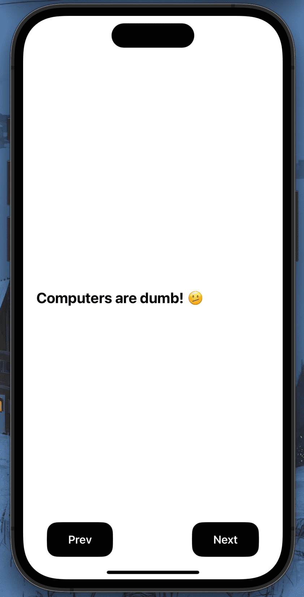
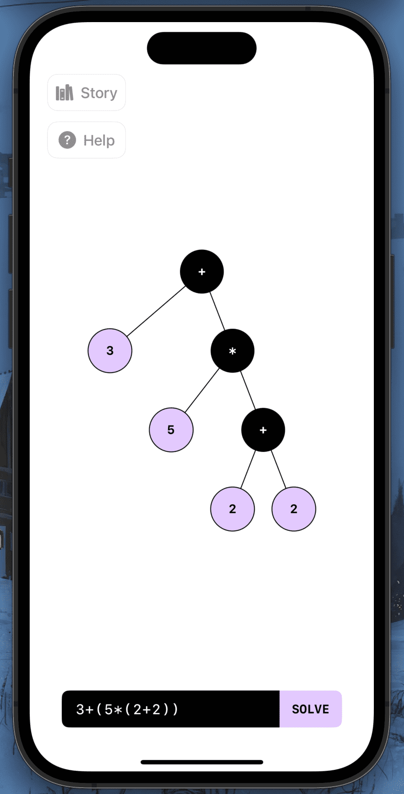

# Matree

Matree is my project made for the 2024 Swift Student Challenge. Its purpose is to show how computers understand and solve mathematical expressions, allowing the user to visualize expressions in the form of an AST (Abstract Syntax Tree).

|  |  |
|:--:|:--:|

## Features

- **Mathematical Tree Visualization**: Matree allows users to visualize mathematical expressions as trees, with nodes representing numbers and operators.
- **Interactive Simulator**: The simulator provides an interactive experience, allowing users to navigate through the tree and understand the structure of the mathematical expression.
- **Story Mode**: For first-time users, Matree provides a story mode that guides them through the usage of the application.

## Getting Started

To get started with Matree, clone the repository and open the project in Xcode. Run the application in the simulator or on a physical device.